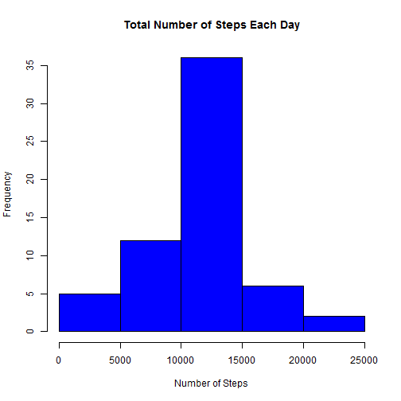

## Loading and preprocessing the data

Reading the activity file and preprocessing it into a format that is suitable for the analysis.


```r
activity <- read.csv("activity.csv", header = TRUE)
activity$date <- as.Date(activity$date)
head(activity)
```

```
##   steps       date interval
## 1    NA 2012-10-01        0
## 2    NA 2012-10-01        5
## 3    NA 2012-10-01       10
## 4    NA 2012-10-01       15
## 5    NA 2012-10-01       20
## 6    NA 2012-10-01       25
```
## What is mean total number of steps taken per day?

Calculating the total number of steps per day.


```r
totalStepsPerDay <- aggregate(steps ~ date, activity, sum);
head(totalStepsPerDay)
```

```
##         date steps
## 1 2012-10-02   126
## 2 2012-10-03 11352
## 3 2012-10-04 12116
## 4 2012-10-05 13294
## 5 2012-10-06 15420
## 6 2012-10-07 11015
```

Plotting a histogram of total number of steps taken each day.


```r
hist(totalStepsPerDay$steps, 
     col = "blue", 
     xlab = "Number of Steps", 
     main = "Total Number of Steps Each Day")
```

 

Calculating mean and median of of the total number of steps per day.


```r
meanStepsPerDay <- mean(totalStepsPerDay$steps, na.rm = TRUE)
medianStepsPerDay <- median(totalStepsPerDay$steps, na.rm = TRUE)
```

- The mean total number of steps taken per day is 10766.19.
- The median total number of steps taken per day is 10765.

## What is the average daily activity pattern?

1. Making a time series plot of the 5-minute interval and the average number of steps taken.

Calculating Steps by Interval


```r
stepsPerInterval <- aggregate(steps ~ interval, activity, mean)
head(stepsPerInterval)
```

```
##   interval     steps
## 1        0 1.7169811
## 2        5 0.3396226
## 3       10 0.1320755
## 4       15 0.1509434
## 5       20 0.0754717
## 6       25 2.0943396
```

```r
# function to convert intervals to contiguous floating point numbers
# so that the plot is contiguous
convertIntervalToTime <- function(interval) {
  hours <- floor(interval / 100)
  mins <- interval - (hours * 100)
  hours + mins / 60
}

stepsPerInterval$intervalContiguous <- convertIntervalToTime(stepsPerInterval$interval);
```

###Plotting average daily activity

####Plotting data by interval


```r
plot(stepsPerInterval$interval, 
     stepsPerInterval$steps, 
     type = "l", 
     xlab = "interval", 
     ylab = "Average Number of Steps", 
     main = "Average Daily Number of Steps by Interval")
```

 

####Plotting data by time of day


```r
plot(stepsPerInterval$intervalContiguous, 
     stepsPerInterval$steps, 
     type = "l", 
     xlim = c(0, 24), 
     xlab = "Time of day (hr)", 
     ylab = "Average Number of Steps", 
     main = "Average Daily Number of Steps by Time of Day")
```

 


```r
maxInterval <- stepsPerInterval[which.max(stepsPerInterval$steps), ]
```


```
##     interval    steps
## 104      835 206.1698
```

The interval with maximum number of steps across all days is 835 (or 8:35) with an average number of steps of 206.1698113.

## Imputing missing values

1. Calculating the total number of missing values in the dataset


```r
numMissingValues <- sum(is.na(activity$steps))
```

The total number of missing values is 2304.

2. Strategy for filling the missing values in the dataset
- Missing **steps** values for an interval in the dataset will be replaced with average number of steps for the same interval computed form the entire dataset.

3. Creating a new dataset with the missing values populated.


```r
new.activity <- merge(x = activity, y = stepsPerInterval, by = "interval", all.x = TRUE)
missingValues <- is.na(new.activity$steps.x)
new.activity[missingValues, "steps.x"] <- 
  as.integer(round(new.activity[missingValues, "steps.y"], 0))
imputed.activity <- new.activity[order(new.activity[, "date"], 
                                       new.activity[, "interval"]), 
                                 c("steps.x", "date", "interval")]
names(imputed.activity)[1] <- "steps"
head(imputed.activity)
```

```
##     steps       date interval
## 1       2 2012-10-01        0
## 63      0 2012-10-01        5
## 128     0 2012-10-01       10
## 205     0 2012-10-01       15
## 264     0 2012-10-01       20
## 327     2 2012-10-01       25
```

4. Creating a histogram of total number of steps taken each day and reporting the mean and median of steps taken per day.


```r
totalStepsPerDay <- aggregate(steps ~ date, imputed.activity, sum);
head(totalStepsPerDay)
```

```
##         date steps
## 1 2012-10-01 10762
## 2 2012-10-02   126
## 3 2012-10-03 11352
## 4 2012-10-04 12116
## 5 2012-10-05 13294
## 6 2012-10-06 15420
```

Plotting a histogram of total number of steps taken each day.


```r
hist(totalStepsPerDay$steps, col = "blue", xlab = "Number of Steps", main = "Total Number of Steps Each Day")
```

 

Calculating mean and median of of the total number of steps per day.


```r
meanStepsPerDay <- mean(totalStepsPerDay$steps, na.rm = TRUE)
medianStepsPerDay <- median(totalStepsPerDay$steps, na.rm = TRUE)
```

- The mean total number of steps taken per day is 10765.64.
- The median total number of steps taken per day is 10762.


## Are there differences in activity patterns between weekdays and weekends?


```r
imputed.activity$daytype <- 
  as.factor(ifelse(weekdays(imputed.activity$date) %in% c("Saturday","Sunday"), 
                   "Weekend", 
                   "Weekday")) 
head(imputed.activity)
```

```
##     steps       date interval daytype
## 1       2 2012-10-01        0 Weekday
## 63      0 2012-10-01        5 Weekday
## 128     0 2012-10-01       10 Weekday
## 205     0 2012-10-01       15 Weekday
## 264     0 2012-10-01       20 Weekday
## 327     2 2012-10-01       25 Weekday
```


```r
stepsPerInterval <- aggregate(steps ~ interval + daytype, imputed.activity, mean)
stepsPerInterval$intervalContiguous <- convertIntervalToTime(stepsPerInterval$interval)
```

###Plotting average daily activity patterns for weekdays and weekends

####Plotting data by interval


```r
library(ggplot2)
ggplot(stepsPerInterval, aes(x = interval, y = steps)) + 
  xlab("Interval") + 
  ylab("Number of Steps") + 
  geom_line() + 
  facet_grid(daytype~.) + 
  ggtitle("Average Daily Activity for Weekdays and Weekends by Interval") 
```

 

####Plotting data by time of day


```r
ggplot(stepsPerInterval, aes(x = intervalContiguous, y = steps)) + 
  xlab("Time of day (hr)") + 
  ylab("Number of Steps") + 
  geom_line() + 
  facet_grid(daytype~.) + 
  ggtitle("Average Daily Activity for Weekdays and Weekends by Time of Day") 
```

 


Based on the above diagrams we see that the patterns for weekday and weekend daily activities are different.


